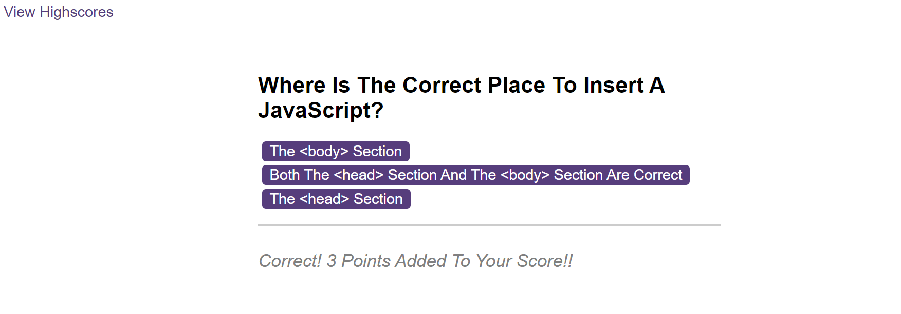
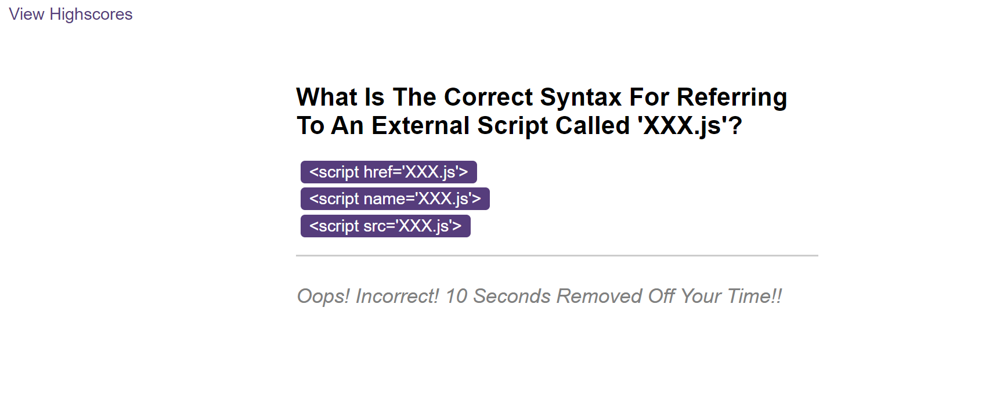

# JavaScript Code Quiz

## Description
The motivation behind this challenge was to create a quiz game using JavaScript which replicated what many developers face by way of being asked to complete a coding assessment. The parameters of this challenge were as follows:
- When the user clicks the "Start" button a series of questions appear.
- Each possible answer to each question must be a button that can be clicked. When this action occurs, the program presents the user with a new question to answer.
- If an incorrect answer is clicked, then time is deducted from the timer.
- The quiz ends when all questions are answered or the timer reaches 0.
- When the game ends, the program should display their score and give the user the ability to save their initials and their score.

Throughout working on this challenge, I have learnt the following:
- How to navigate and manipulate the DOM (Document Object Model)
- Reinforced my knowledge and capabilities to implement JavaScript functions.
- How to store and retrieve data from local (client side) storage.

#
## Table Of Contents
- [Usage](#usage)
- [Credits](#credits)
- [Deployment](#deployment)
- [License](#license)

#
## Usage
In order for the program to run, you as the user will need to click on the "Start Quiz" button as shown in the screenshot below:

Once you have clicked this button, you as the user will be presented with a series of questions one at a time to answer within a 75 second timeframe. An example of a question can be seen below:

If you as the user selects a correct answer, you will be informed of this by some written feedback on screen and a sound effect:

If you as the user selects an incorrect answer, you will be informed of this by some written feedback on screen and a sound effect:

When you as the user completes the game, you will be presented with your score and the opportunity to enter your intials so that your score can be saved:

When the "Submit" button is clicked, you as the user will be taken to the "HighScores" page where both the initials and score can be seen:

The user can then either click the "Go Back" button and have another try or alternatively clear the scores saved by clicking the "Clear Highscores" button.

#
## Credits
Throughout working on this challenge, I sought the knowledge and advice from multiple sources including:
- https://www.w3schools.com/quiztest/quiztest.asp?qtest=JS
- https://code.mu/en/javascript/book/prime/timers/stop-button/
- https://www.w3schools.com/js/js_timing.asp
- https://www.w3schools.com/howto/howto_js_toggle_hide_show.asp
- https://herewecode.io/blog/create-button-javascript/#:~:text=To%20create%20a%20button%20in%20JavaScript%2C%20you%20must%20use%20the,button%20element%20const%20button%20%3D%20document
- https://foolishdeveloper.com/how-to-play-sound-on-click-using-javascript/
- https://stackoverflow.com/questions/40610504/how-to-play-wav-file-in-explorer-with-javascript
- https://www.w3schools.com/jsref/prop_win_localstorage.asp
- https://w3docs.com/snippets/javascript/how-to-get-the-value-of-text-input-field-using-javascript.html
- https://stackoverflow.com/questions/16562577/how-can-i-make-a-button-redirect-my-page-to-another-page
- https://developer.mozilla.org/en-US/docs/Web/API/Window/DOMContentLoaded_event
- https://www.w3schools.com/js/js_array_sort.asp
- https://www.w3schools.com/jsref/met_storage_removeitem.asp

#
## Deployment
Below is the link to the deployed webpage using GitHub Pages:
- https://maccersm8.github.io/JavaScript-Coding-Quiz/

#
## License
Copyright (c) 2023 Maisie McDonald

Permission is hereby granted, free of charge, to any person obtaining a copy
of this software and associated documentation files (the "Software"), to deal
in the Software without restriction, including without limitation the rights
to use, copy, modify, merge, publish, distribute, sublicense, and/or sell
copies of the Software, and to permit persons to whom the Software is
furnished to do so, subject to the following conditions:

The above copyright notice and this permission notice shall be included in all
copies or substantial portions of the Software.

THE SOFTWARE IS PROVIDED "AS IS", WITHOUT WARRANTY OF ANY KIND, EXPRESS OR
IMPLIED, INCLUDING BUT NOT LIMITED TO THE WARRANTIES OF MERCHANTABILITY,
FITNESS FOR A PARTICULAR PURPOSE AND NONINFRINGEMENT. IN NO EVENT SHALL THE
AUTHORS OR COPYRIGHT HOLDERS BE LIABLE FOR ANY CLAIM, DAMAGES OR OTHER
LIABILITY, WHETHER IN AN ACTION OF CONTRACT, TORT OR OTHERWISE, ARISING FROM,
OUT OF OR IN CONNECTION WITH THE SOFTWARE OR THE USE OR OTHER DEALINGS IN THE
SOFTWARE.

